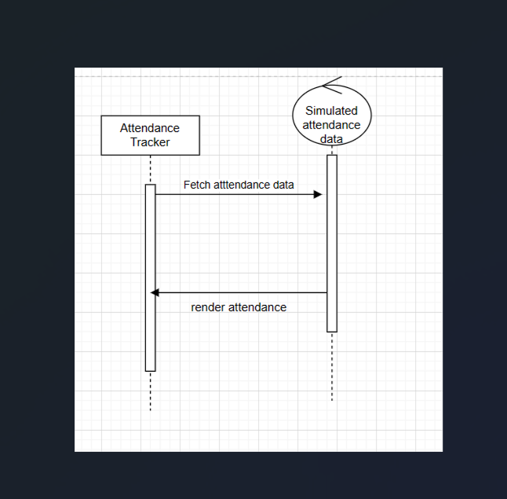
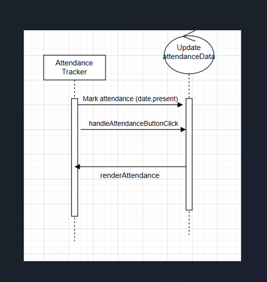
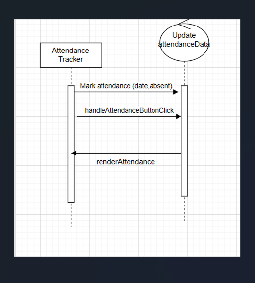

# Attendance Tracking Software Documentation

## Introduction

This document provides a detailed overview of the Attendance Tracking Software, highlighting its purpose, scope, software architecture, design, test cases, and the tools, languages, frameworks, and platforms used. Additionally, it includes insights into the Continuous Integration (CI) setup with TeamCity.

## Purpose

The Attendance Tracking Software aims to revolutionize the management and monitoring of student attendance in educational institutions. It empowers educators and administrators with a user-friendly platform that seamlessly integrates into the existing school ecosystem, providing real-time tracking and comprehensive reporting.

## Scope of the Software

### Software Requirements

The software caters to the following requirements:

1. **User-Centric Design:**
   - Intuitive interface for teachers to effortlessly record and manage attendance.
   
2. **Real-time Tracking:**
   - Instant marking and updating of attendance to enhance accuracy and prompt decision-making.
   
3. **Comprehensive Reporting:**
   - Detailed attendance reports for administrators with insights into student attendance patterns.

4. **Interoperability:**
   - Built on RESTful API conventions for seamless integration with other school systems.

5. **Reliability and Performance:**
   - Responsive experience with minimal downtime, ensuring stability during school hours.

### Software Architecture

The software follows a modular architecture to ensure scalability and adaptability to evolving educational needs.

## Software Design and Model

### UML Diagrams

#### Figure 1: Sequence Diagram - Student Login

The UML sequence diagram illustrates the interaction between the Student and AttendanceTracker classes during the login process. The sequence begins as the Student initiates a login request, prompting the AttendanceTracker to authenticate the provided credentials. The AttendanceTracker interfaces with the authentication module, validating the student's details. Upon successful authentication, the AttendanceTracker grants access to the Student, allowing them to log in. This concise representation encapsulates the key steps and interactions involved in the student login process within the software system.

#### Figure 2: Sequence Diagram - Fetch Attendance Data

The UML sequence diagram portrays the interaction between the Student and AttendanceTracker in the context of fetching attendance data. The sequence unfolds as the Student initiates a request, triggering the AttendanceTracker to process the inquiry. The AttendanceTracker, in turn, interacts with the data source to retrieve the attendance records. Once the data is obtained, the AttendanceTracker provides the fetched attendance information back to the Student. This succinct representation encapsulates the key steps and interactions involved in the process of fetching attendance data within the software system.

#### Figure 3: Sequence Diagram - Mark Attendance as Present

The UML sequence diagram depicts the interaction between the AttendanceTracker and UpdateAttendanceData classes when marking attendance as "present." The sequence commences with the AttendanceTracker initiating a request to update attendance data. The UpdateAttendanceData class processes the request, interacting with the data source to record the student's presence. Upon successful updating of attendance, the UpdateAttendanceData class communicates the status back to the AttendanceTracker. This succinct representation encapsulates the crucial interactions and event flow associated with marking attendance as "present" within the software system.

#### Figure 4: Sequence Diagram - Mark Attendance as Absent

The UML sequence diagram illustrates the collaboration between the AttendanceTracker and UpdateAttendanceData classes during the process of marking attendance as absent. The sequence initiates when the AttendanceTracker sends a request to update the attendance data, triggering the UpdateAttendanceData class. Subsequently, the UpdateAttendanceData class interacts with the data source to record the student's absence. Once the attendance is successfully updated, the UpdateAttendanceData class communicates the status back to the AttendanceTracker. This concise representation encapsulates the essential interactions and flow of events involved in marking attendance as absent within the software system.

## Test Cases

### Marking Student Attendance

#### Test Case 1: Successful Login

1. **Input:** Valid student name (M Joel) and ID (1).
2. **Expected Output:** User should be logged in, and the attendance list should be displayed.

#### Test Case 2: Invalid Login

1. **Input:** Invalid student name (Lionna M) and ID (4).
2. **Expected Output:** User should receive an alert about invalid credentials.

#### Test Case 3: Mark Attendance as Present

1. **Input:** Click on "Present" button for a specific class session.
2. **Expected Output:** Attendance status should be updated to "Present."

#### Test Case 4: Mark Attendance as Absent

1. **Input:** Click on "Absent" button for a specific class session.
2. **Expected Output:** Attendance status should be updated to "Absent."

## Tools, Languages, Frameworks, Platforms

- **Languages:** HTML, JavaScript
- **Frameworks:** None
- **Platforms:** Web-based
- **Version Control:** GitHub
- **Continuous Integration:** [TeamCity](#continuous-integration-ci-setup-with-teamcity)

### Continuous Integration (CI) Setup with TeamCity

Continuous Integration (CI) is crucial in software engineering, automating code integration and testing to detect issues early, reduce bugs, and enhance stability. For detailed information on the CI setup, refer to the [Continuous Integration (CI) Setup with TeamCity](#continuous-integration-ci-setup-with-teamcity) section.

## Conclusion

The Attendance Tracking Software is designed to be the cornerstone of effective attendance management, aligning with modern educational requirements while prioritizing user experience, reliability, and adaptability.
